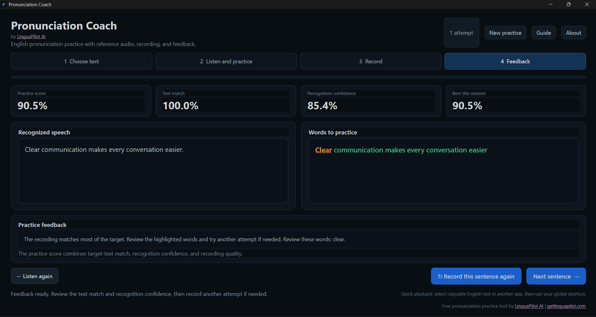
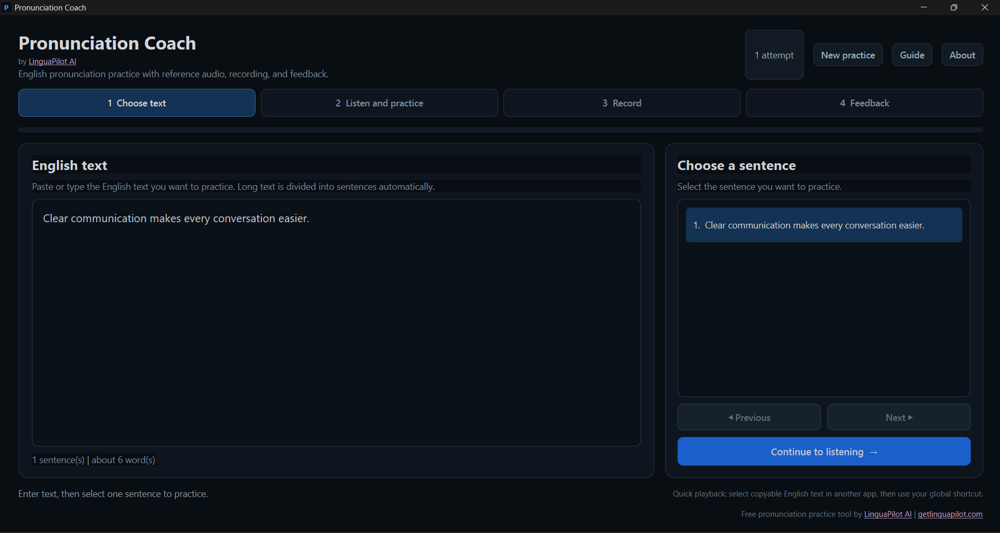
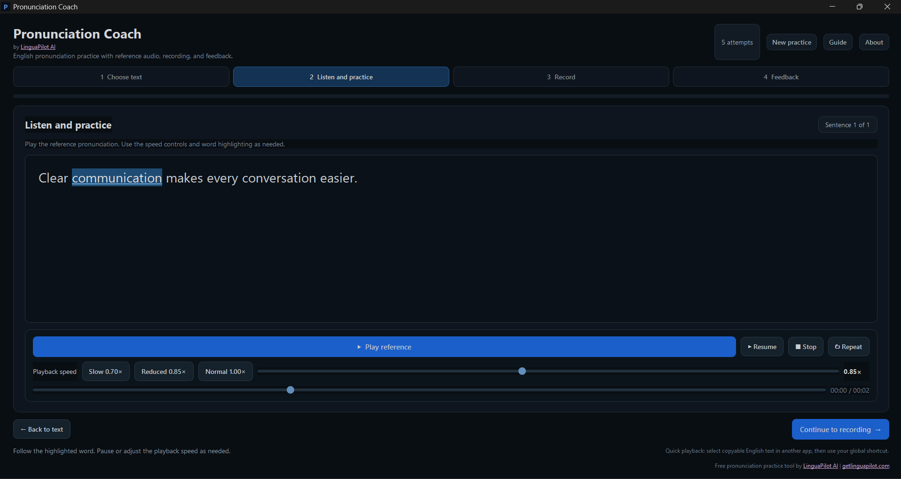
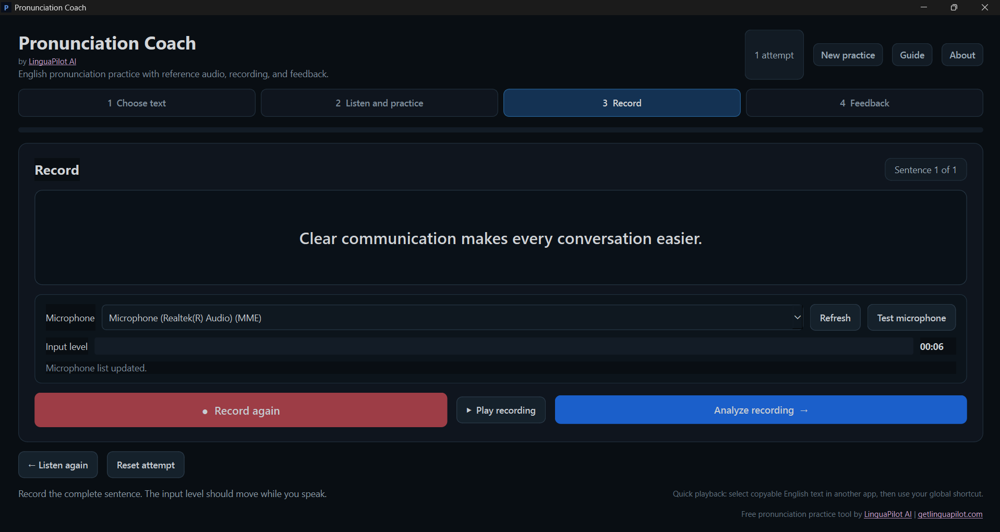

# Pronunciation Coach for Windows

**100% free English pronunciation practice for Windows 10 and 11.**

Select English text in most Windows apps and press `Ctrl+Alt+P` to hear it instantly. Record yourself to get an instant practice score and feedback on words to review.

👉 **[Download Pronunciation Coach Free](https://getlinguapilot.com/free-tools/pronunciation-coach/)**

No subscription. No account required in the app. Designed for local, private pronunciation practice.

## Why Pronunciation Coach?

Pronunciation Coach helps you practise the English you actually use in documents, emails, presentations, meetings, browser pages and other Windows applications.

### Instant pronunciation from Windows

Select copyable English text in another application and press:

`Ctrl + Alt + P`

Pronunciation Coach reads the selected text aloud without requiring you to copy it manually into the main window.

### Listen and practise

Paste or type your own English text, listen to the reference pronunciation and adjust the playback speed while you practise.

### Record yourself

Use your microphone to record the sentence and play your recording back before analysis.

### Get instant practice feedback

Pronunciation Coach provides:

- Practice score
- Target-text match
- Recognition confidence
- Words to review
- Best score for the current session

The practice score is designed as practical learning feedback. It is not a phoneme-by-phoneme pronunciation certification.

## How it works

### 1. Choose your text

### 2. Listen and practise

### 3. Record yourself

### 4. Review your feedback

## Privacy and local-first design

Pronunciation Coach is designed as a lightweight Windows desktop tool. Core speech practice features run locally on your computer, helping you practise without sending every sentence to an online pronunciation service.

## Download

For the latest Windows version, screenshots and product information:

👉 **[Pronunciation Coach official page](https://getlinguapilot.com/free-tools/pronunciation-coach/)**

## Part of the LinguaPilot AI software suite

Pronunciation Coach focuses on **spoken English**.

If you also want help improving your written English, discover **LinguaPilot AI**, a Windows AI writing coach for correcting, rewriting and understanding selected text with local AI support.

👉 **[Discover LinguaPilot AI](https://getlinguapilot.com/)**

More free language tools:

👉 **[LinguaPilot Free Tools](https://getlinguapilot.com/free-tools/)**

---

**Pronunciation Coach is a free tool by LinguaPilot AI.**
